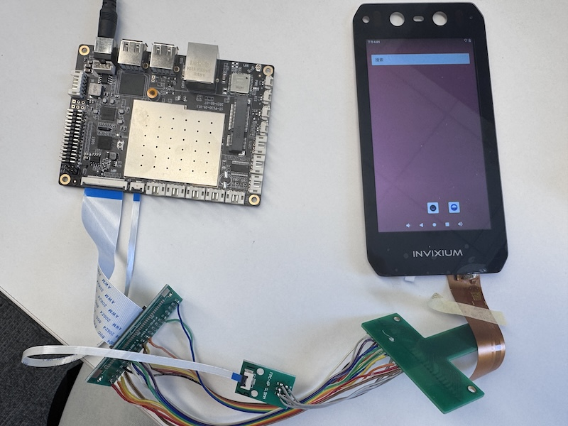

# RK050BHD335 TFT Display

**Rocktech Part Number:** RK050BHD335
**Display Size:** 5.0 inch  
**Resolution:** 720 x 1280 pixels  
**Interface:**  MIPI  
**Touch Panel:** Capacitive touch (CTP)  
**Panel Type:** IPS  
**Brightness:** 350 nits  
**Viewing Angle:** All View / 80° each direction  
**Operating Temperature:** -20°C ~ +60°C  

---

## 📂 Files Included

- `RK050BHD335.dts`: Device tree include snippet for Linux/Android systems

---

## 💡 Usage Notes

- Used with Rockchip PX30, Android 11, kernel version is 5.10, MIPI interfaces
- CTP may require Goodix or FocalTech driver (depending on your touchscreen controller)

---

## 🔗 Official Product Page

[https://www.rocktech.com.hk/lcd-product/rk050bhd206a0/](https://www.rocktech.com.hk/lcd-product/rk050bhd206a0/)

## RK050BHD335 Display on PX30

This is the actual running image on the PX30 platform with the Rocktech RK050BHD335 TFT panel.

