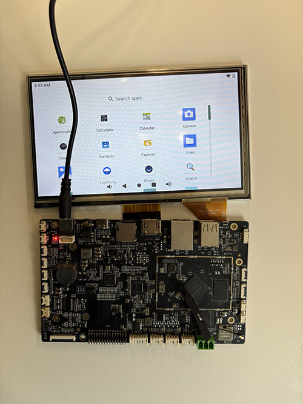
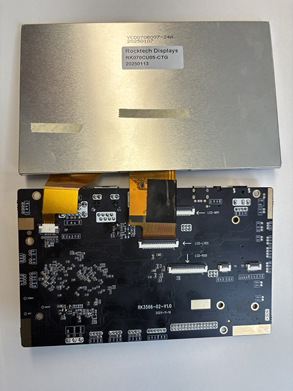

# RK070CU05 TFT Display

**Rocktech Part Number:** RK070CU05
**Display Size:** 7.0 inch  
**Resolution:** 1024 x 600 pixels  
**Interface:**  MIPI  
**Touch Panel:** Capacitive touch (Option)  
**Panel Type:** IPS  
**Brightness:** 500 nits  
**Viewing Angle:** All View / 80° each direction  
**Operating Temperature:** -20°C ~ +70°C  

---

## 📂 Files Included

- `RK070CU01.dtsi`: Device tree include snippet for Linux/Android systems

---

## 💡 Usage Notes

- Used with Rockchip RK3566, Linux Buildroot, kernel version is 5.10, RGB interfaces
- CTP may require Goodix or FocalTech driver (depending on your touchscreen controller)

---

## 🔗 Official Product Page

[https://www.rocktech.com.hk/lcd-product/rk070cu01/](https://www.rocktech.com.hk/lcd-product/rk070cu01/)

## RK070CU05 Display on RK-Android-3566-02

This is the actual running image on the RK3566 platform with the Rocktech RK070CU05 TFT panel.

